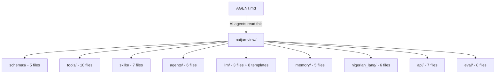

# NaijaReview Scaffold Summary

## What Was Created

The entire NaijaReview repository has been scaffolded from the 1773-line internal architecture document (`docs/NTERNAL_ARCHITECTURE.md`). Everything is ready for the team (Testimony, Aaliyah, Shiloh) to start implementing.

## File Count: 95 files

| Category | Count | Details |
|----------|-------|---------|
| Python source | 64 | All `__init__.py`, schemas, tools, skills, agents, LLM, memory, Nigerian lang, API, eval |
| Test files | 8 | Unit (4), integration (3), eval (1) — all with skip-marked stubs |
| Jinja templates | 8 | All prompt templates from §9 |
| Config/build | 6 | pyproject.toml, Dockerfile, docker-compose.yml, .env.example, .pre-commit-config.yaml, .gitignore |
| Documentation | 3 | README.md, AGENT.md, NTERNAL_ARCHITECTURE.md |
| Data files | 5 | taxonomy.yaml + 4 .gitkeep placeholders |

## Architecture Mapped to Code

## Key Design Decisions

1. **Dependency groups** — Heavy ML deps (ChromaDB, FAISS, spaCy, sentence-transformers) separated into optional `ml` group. Base install is fast for schema/API work.

2. **LLM Router** — Fully implemented in `naijareview/llm/router.py` with Sonnet/Haiku two-tier routing + retry logic. This is the only module with a complete implementation.

3. **Stubs with TODOs** — Every module has the correct class/function signatures, docstrings referencing the architecture doc section, and `# TODO` markers with ownership notes (which teammate should implement it).

4. **AGENT.md** — Self-updating knowledge base. Every AI agent is instructed to add discoveries to the Knowledge Base section.

## What the Team Should Do Next

| Person | First Task | Files to Start With |
|--------|-----------|-------------------|
| **Testimony** | Implement `FingerprintBuilder` skill + `build_behavioural_fingerprint` tool | `skills/fingerprinting.py`, `tools/fingerprint.py` |
| **Aaliyah** | Implement `EpisodicMemory` + `ItemIndex` | `memory/episodic.py`, `memory/item_index.py` |
| **Shiloh** | Populate phrase library JSONs + expand taxonomy.yaml | `data/phrase_library/`, `data/taxonomy.yaml` |

> [!IMPORTANT]
> Poetry install with all ML dependencies is slow (10+ minutes). Use `poetry install --without ml,eval` for fast iteration on schemas, tools, and API work.
